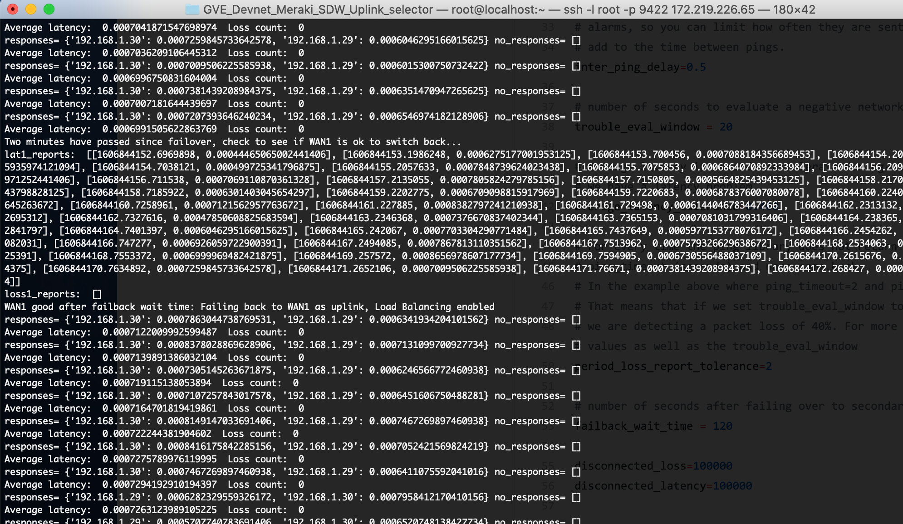

# Meraki SDW Uplink selector
Sample code that uses ping to evaluate Meraki MX uplink interfaces and determines when to fail over to WAN2 in case of problems with WAN1 
and when to fail back. 

## Contacts
* Maxime Acquatella
* Gerardo Chaves

## Solution Components
* Meraki MX65

## Installation/Configuration

* This sample uses a variant of the python multi-ping library found at: https://github.com/romana/multi-ping .
The functionality is containted in the `mping.py` source file. 

* Make sure you have Python3.6 or later installed

* Install the necessary libraries:  
``` pip install -r requirements.txt```  

* Set your Meraki API key and OrgID in the `credentials.py` file.  
To obtain the API key, open your Meraki dashboard: https://dashboard.meraki.com  
Once logged in, navigate to the Organization Settings menu.  
Ensure that the API Access is set to “Enable access to the Cisco Meraki Dashboard API”  
Then go to your profile to generate the API key. (save this key in a secure location, as it represents your admin credentials)  
More details here: https://developer.cisco.com/meraki/api/#!authorization/authorization  
To obtain the Org ID, you can use the /organizations REST API call as documented here: 
https://developer.cisco.com/meraki/api/#!get-organizations  
Here are details on how to obtain it using Postman also:  
https://developer.cisco.com/meraki/meraki-platform/#step-2-get-the-organization-id


* Edit the configuration parameters in `MX_uplink_monitor_selector.py`:  
    
    *ping_timeout* and *ping_retry* usage:
    Using these parameters the code will ping the addresses up to ping_retry+1 times (initial ping + 3 retries), over the
    course of ping_timeout seconds.
    For example, if ping_timeout=.5 and ping_retry=0, for those addresses that do not
    respond another ping will be sent every 0.5 seconds.
    ##### NOTE: Never set the average_latency_tolerance less than or equal to ping_timeout otherwise you will not be able to accurately measure average latency since delayed packets will simply be reported as missing (loss)
    
    *inter_ping_delay* is the time to wait before invoking multi-ping. If all devices in the list reply to the ping quickly then
    there could potentially be a flurry of pings from this script to the various devices which could be detrimental or even raise
    alarms, so you can limit how often they are sent out. When there is packet loss and disconnected interfaces then the ping_timeout will
    add to the time between pings.
    
    *trouble_eval_window* is the number of seconds to evaluate a negative network condition
    
    *average_latency_tolerance* is the average latency in seconds to tolerate during the trouble_eval_window time period before deciding if we have a latency problem
    ##### NOTE: As mentioned above, never set the average_latency_tolerance to less than or equal to ping_timeout 
    *period_loss_report_tolerance*: 
    For every time the ping library does not return a result it is because ping_retry+1 packets were sent within
    ping_timeout (seconds) and none came back.
    In the example above where ping_timeout=.5 and ping_retry=0, any missed results represents 1 packet within .5 seconds.
    That means that if we set trouble_eval_window to 20 seconds and period_loss_report_tolerance to 12
    we are detecting a packet loss of 30%. For more granularity on packet loss, reduce the ping_timeout and ping_retry
    values as well as the trouble_eval_window
    
    *failback_wait_time* is the number of seconds after failing over to secondary WAN link to wait until evaluating main link again to switch back

    *useWhiteList* is a boolean (set to True or False) that can be used to only include devices from certain NetworkIds in the monitoring.  
    To specify the list of network IDs to consider, add them one per line in the `networks_whitelist.txt` file in the same directory as this Python script. If the file is missing it will consider the whitelist as empty and not monitor any devices unless you set useWhiteList to False  

## Usage


To launch the script:

    $ sudo python MX_uplink_monitor_selector.py

### NOTE:   
You need to run with root priviledges to be able to send ICMP packets using the ping functionality. 

# Screenshots





### LICENSE

Provided under Cisco Sample Code License, for details see [LICENSE](LICENSE.md)

### CODE_OF_CONDUCT

Our code of conduct is available [here](CODE_OF_CONDUCT.md)

### CONTRIBUTING

See our contributing guidelines [here](CONTRIBUTING.md)

#### DISCLAIMER:
<b>Please note:</b> This script is meant for demo purposes only. All tools/ scripts in this repo are released for use "AS IS" without any warranties of any kind, including, but not limited to their installation, use, or performance. Any use of these scripts and tools is at your own risk. There is no guarantee that they have been through thorough testing in a comparable environment and we are not responsible for any damage or data loss incurred with their use.
You are responsible for reviewing and testing any scripts you run thoroughly before use in any non-testing environment.